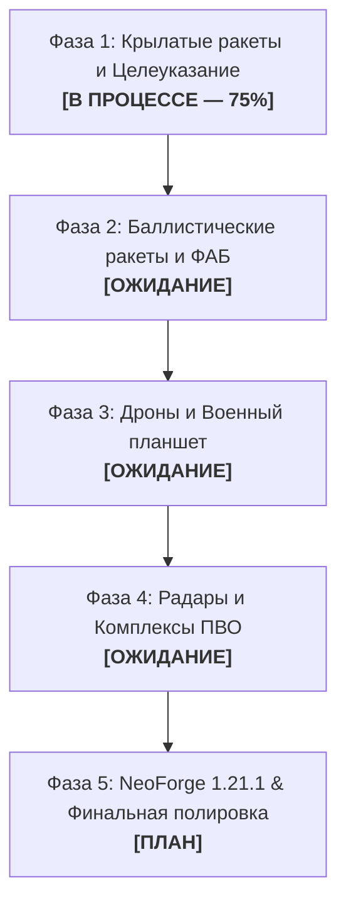

# 🗺 Дорожная карта разработки AeroStrike (Roadmap)

Масштабный военно-технический мод для **Minecraft 1.20.1 Forge** (с архитектурным заделом под **NeoForge 1.21.1**).

---

## 📌 Текущий прогресс: Обзор фаз

---

## 🚀 ФАЗА 1: Крылатые ракеты и Наведение [ТЕКУЩАЯ]
- [x] **Базовое физическое ядро (`AbstractCruiseMissileEntity`)**:
  - [x] Стейт-машина полета: `BOOST` / `AIR_DROP` $\rightarrow$ `CRUISE` $\rightarrow$ `TERMINAL`.
  - [x] Автопилот огибания рельефа (Terrain Following Radar) через рейкасты по курсу.
  - [x] Плавная инерция и виражи (SLERP-интерполяция углов).
  - [x] Чанклоадинг в полете (`MissileChunkManager`) с гарантированным освобождением билетов.
  - [x] Интеграция с GeckoLib 4.8.4 и авто-экспорт `.jar`.
- [x] **FP-5 «Flamingo»** (Тяжелая крылатая ракета наземного базирования с РДТТ-бустером и БЧ 1150 кг).
- [x] **Storm Shadow / SCALP-EG** (Стелс-ракета воздушного сброса, низкая ЭПР, проникающая БЧ BROACH).
- [ ] **1.4. Система наведения и программирования координат**:
  - [ ] Лазерный целеуказатель (`LaserDesignator`): рейкаст до 300м, захват точки, запись в NBT-фасад.
  - [ ] GPS-программатор координат: ручной ввод координат X, Y, Z и высоты эшелона.
- [ ] **1.5. Наземные пусковые платформы**:
  - [ ] Наклонная направляющая / катапульта для Flamingo со стартом от Redstone.
  - [ ] Подвесной пилон для самолетов / механических сбросов.

---

## ☄️ ФАЗА 2: Баллистические ракеты и Авиабомбы (ФАБ)
- [ ] **2.1. Суборбитальная баллистическая физика (`AbstractBallisticMissileEntity`)**:
  - [ ] Расчет параболической дуги с выходом в стратосферу ($Y > 320$) и падением на гиперзвуке.
  - [ ] Разделение ступеней (сброс разгонного блока, отделение боевой части).
  - [ ] Баллистическая ракета (прототип: **ATACMS** / **Точка-У**).
- [ ] **2.2. Планирующие авиабомбы (ФАБ с УМПК)**:
  - [ ] Сущность планирующей бомбы (**ФАБ-500** с раскладными крыльями УМПК).
  - [ ] Аэродинамическое планирование при сбросе с высоты в заданный квадрат.
- [ ] **2.3. Модульные боевые части (БЧ)**:
  - [ ] Фугасная тяжелая (High Explosive).
  - [ ] Проникающая бетонобойная (Bunker-Buster).
  - [ ] Кассетная (разброс суббоеприпасов по площади).

---

## 🎮 ФАЗА 3: Комплекс Дронов и Планшет оператора
- [ ] **3.1. Физический движок квадрокоптеров (`AbstractDroneEntity`)**:
  - [ ] 4-векторная тяга моторов: Roll, Pitch, Yaw, Throttle, инерция и гравитация.
- [ ] **3.2. FPV-дрон камикадзе**:
  - [ ] Маневренность, контактный взрыватель, высокая скорость пикирования.
- [ ] **3.3. Разведывательный дрон (Recon Drone)**:
  - [ ] Зависание на высоте, подсветка целей для ракет, тепловизор/ночное видение.
- [ ] **3.4. Военный планшет оператора (`MilitaryTablet`)**:
  - [ ] Клиентский перехват камеры (`Minecraft.setCameraEntity(drone)`).
  - [ ] OSD-интерфейс экрана (прицел, авиагоризонт, заряд аккумулятора, статические помехи связи при удалении).
  - [ ] Сетевой канал C2S для передачи нажатий клавиш без задержки.

---

## 🛡 ФАЗА 4: РЛС и Комплексы ПВО (Противовоздушная оборона)
- [ ] **4.1. Радиолокационные станции (РЛС)**:
  - [ ] Блок РЛС раннего обнаружения (`RadarBlockEntity`).
  - [ ] Сканирование воздушного пространства в радиусе (проверка прямой видимости / Line of Sight).
  - [ ] Учет радарной заметности ракет (ЭПР / RCS) — стелс-ракеты (Storm Shadow) засекаются только в упор.
- [ ] **4.2. Комплексы ПВО и Зенитные ракеты (SAM)**:
  - [ ] Пусковая батарея ЗРК (прототип: **Patriot** / **Бук**).
  - [ ] Наведение зенитных ракет методом пропорционального сближения (Proportional Navigation).
  - [ ] Перехват и уничтожение крылатых и баллистических ракет прямо в воздухе.

---

## ⚙️ ФАЗА 5: Звуки, Эффекты и Порт на 1.21.1 NeoForge
- [ ] **5.1. Звуковое сопровождение**:
  - [ ] Пространственный свист турбины АИ-25ТЛ / Microturbo при пролете ракеты над игроком.
  - [ ] Эффект преодоления звукового барьера (Sonic Boom).
  - [ ] Сирены воздушной тревоги при обнаружении целей радаром.
- [ ] **5.2. Визуальные эффекты**:
  - [ ] Инверсионные следы, клубы стартового дыма, тепловое марево за двигателем.
- [ ] **5.3. Портирование на NeoForge 1.21.1**:
  - [ ] Замена слоя `ItemDataFacade` с NBT на `DataComponentType`.
  - [ ] Перевод сети на `CustomPacketPayload` / `IPayloadHandler`.
